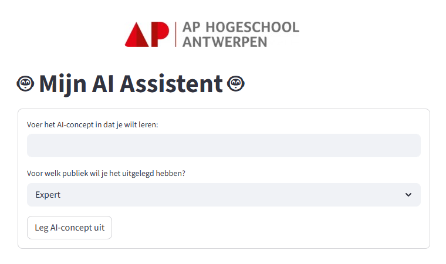

# GenAI Workshop - AP Hogeschool

Workshop materiaal voor het bouwen van AI-applicaties met Python en Streamlit.

**Datum:** 11 maart 2026

**Lesgever:** Wim Casteels - [wimcasteels.be](https://wimcasteels.be)



**Live demo:** [ict-praktijkdag-ai-assistent.streamlit.app](https://ict-praktijkdag-ai-assistent.streamlit.app/)

## Installatie

Installeer de vereiste Python packages (Streamlit, Cohere, ...):

```bash
pip install -r requirements.txt
```

Dit kan je doen op je eigen pc (bijvoorbeeld in een virtuele omgeving) of op de servers van GitHub via Codespaces (zie hieronder).

## Workshop volgen via GitHub Codespaces

**Tip:** Kopieer deze repository eerst naar je eigen GitHub account. Zo kan je je wijzigingen bewaren en later je app deployen via Streamlit Cloud.

1. Klik rechtsboven op **Use this template** om de repository te kopiëren naar je eigen account
2. Ga naar jouw gekopieerde repository
3. Klik op de groene **Code** knop
4. Selecteer het tabblad **Codespaces**
5. Klik op **Create codespace on main**
6. Wacht tot de omgeving is opgestart - alle dependencies worden automatisch geïnstalleerd
7. Je kan nu de notebooks en applicaties uitvoeren in de browser

## Inhoud

### Python_met_AI.ipynb

Dit is een **Jupyter Notebook**: een interactief document waarin je code, tekst en resultaten combineert in afzonderlijke cellen. Je kan elke cel apart uitvoeren, wat ideaal is om stap voor stap te leren programmeren.

Deze notebook behandelt een aantal Python functies die van pas komen om een AI app te maken:
- Basisconcepten: strings, integers, floats
- f-Strings voor het combineren van tekst en berekeningen
- Variabelen en hun gebruik in prompts
- Werken met de `chatbot_response()` functie om een LLM aan te spreken

#### LLM API

Om een LLM (Large Language Model) aan te spreken vanuit Python heb je een API nodig. Er zijn veel mogelijke providers (bijvoorbeeld OpenAI, Google of OpenRouter), maar in deze workshop maken we gebruik van **Cohere**. Cohere biedt een gratis trial key aan die je kan aanmaken via [deze pagina](https://cohere.com/blog/free-developer-tier-announcement).

**Let op:** de API key staat momenteel rechtstreeks in de code. Dit is handig voor deze workshop, maar mag normaal gezien nooit zo gedaan worden. In een echt project werk je met een **omgevingsvariabele** zodat je key niet zichtbaar is in de broncode.

### eerste_app.py

[Streamlit](https://streamlit.io/) is een Python framework waarmee je snel interactieve webapplicaties kan bouwen zonder kennis van HTML, CSS of JavaScript. Met eenvoudige Python commando's maak je invoervelden, knoppen, sliders en meer. Een overzicht van alle beschikbare widgets vind je in de [Streamlit widget documentatie](https://docs.streamlit.io/develop/api-reference/widgets).

Een voorbeeld van een eenvoudige Streamlit applicatie met:
- Titel en tekst weergave
- Interactieve slider
- Berekening (kwadraat)

Run de app lokaal:
```bash
streamlit run eerste_app.py
```

### AI_app.py
Een voorbeeld van een AI applicatie die:
- Gebruikersinput verzamelt via een formulier
- AI concepten uitlegt aangepast aan het niveau van de gebruiker (Expert, Leek, 12-jarig kind)
- Gebruik maakt van de Cohere API voor het genereren van antwoorden

Run de app lokaal:
```bash
streamlit run AI_app.py
```

## Opdracht

1. **Python & AI notebook** — Ga door de `Python_met_AI.ipynb` notebook, run de code en maak de oefeningen om vertrouwd te geraken met hoe je Python kan gebruiken voor AI toepassingen.
2. **Streamlit verkennen** — Bekijk de `eerste_app.py` Streamlit applicatie om vertrouwd te geraken met Streamlit. Maak een aanpassing en voeg een extra input widget toe.
3. **AI applicatie bouwen** — Bekijk de `AI_app.py` Streamlit applicatie om te zien hoe je een applicatie kan laten aandrijven door een LLM. Maak een eigen Streamlit applicatie met een LLM.
4. **(Optioneel) Deployment** — Deploy je app via Streamlit Cloud zodat deze voor iedereen beschikbaar is (zie hieronder).

## Deployment

Je kan de app deployen via [Streamlit Cloud](https://streamlit.io/cloud). Dit laat je toe om je app te delen met andere mensen. Het enige wat je nodig hebt is een openbare GitHub repository waar je app staat. Volg hiervoor de instructies op de Streamlit Cloud website.
